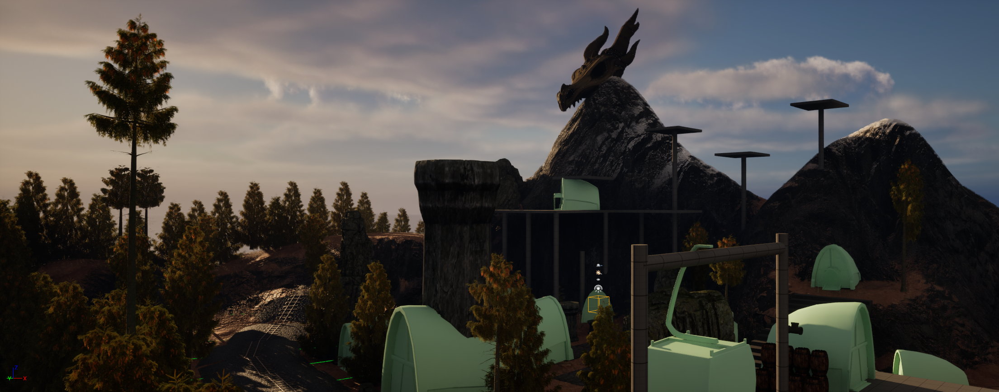
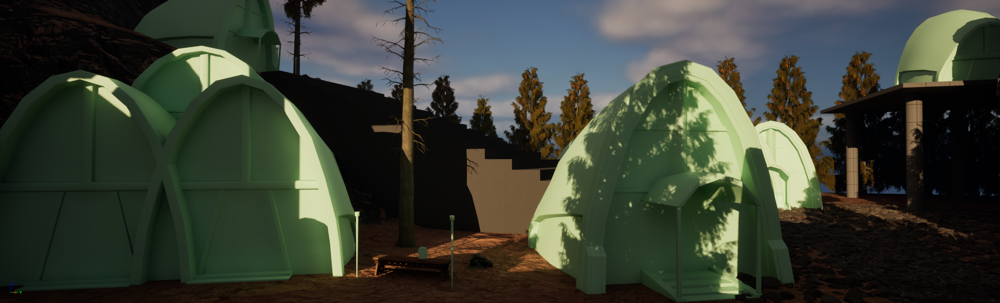
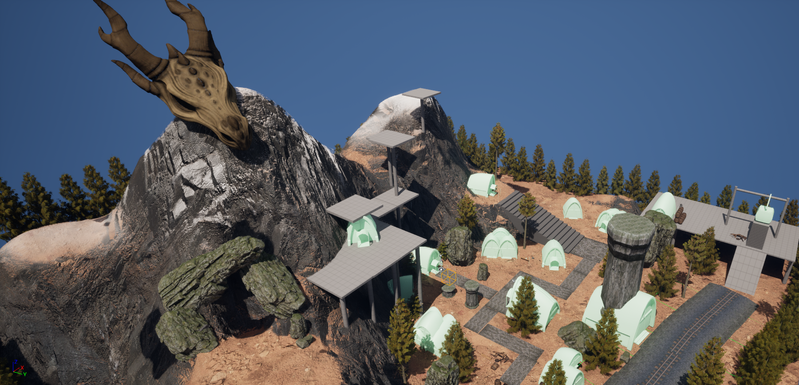
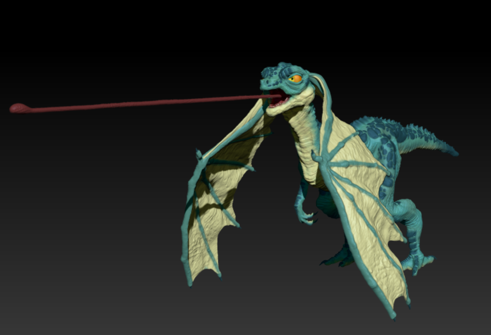
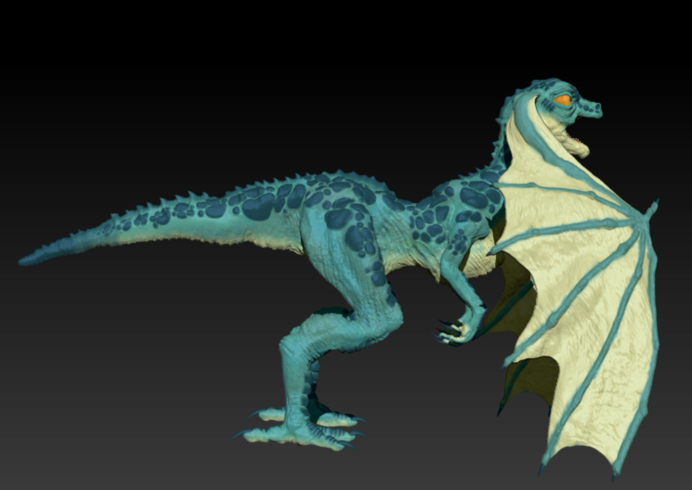
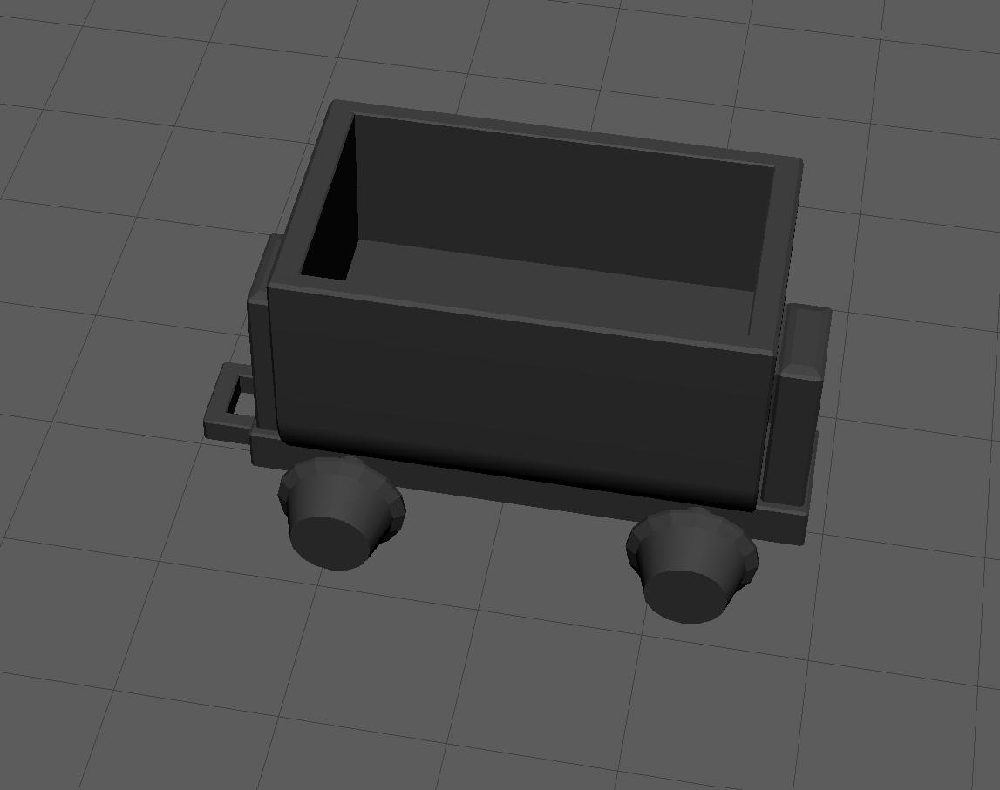
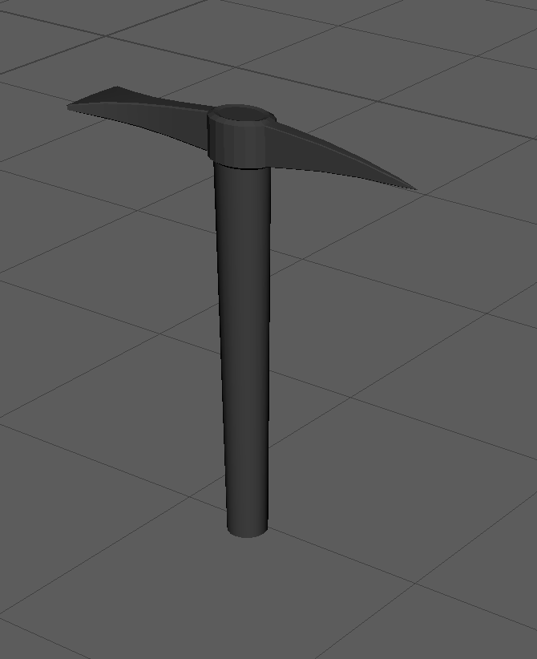
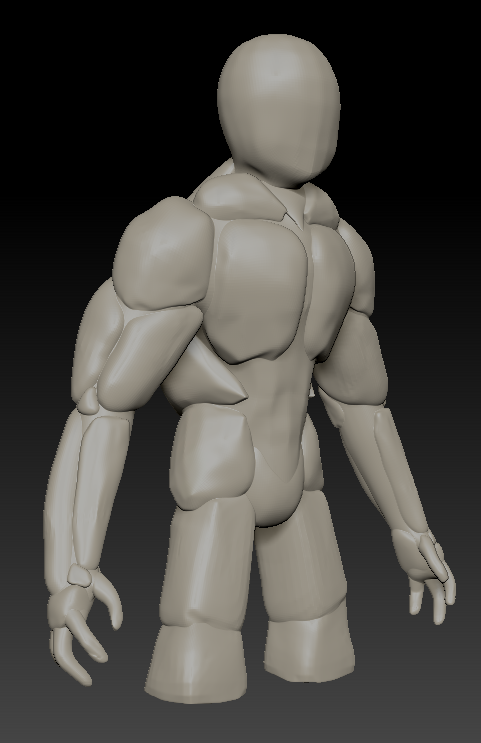
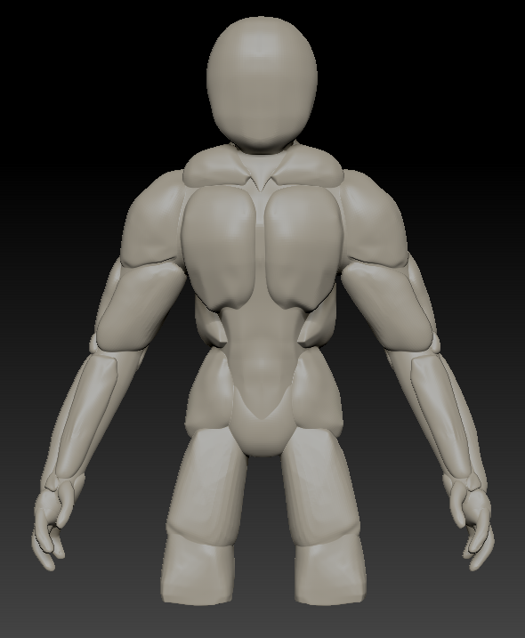

<head>
    <title> Scaling the Summit </title>
    <link rel="stylesheet" type="text/css" href="style.css"/>
    <meta name="viewport" content="width=device-width, user-scalable=no" />
</head>

# Scaling the Summit 

Welcome to the page for team Hue-nique's game, Scaling the summit! 

## Our team: 

### Art team:

    Griffin Bowers (good): gbowers@wpi.edu
        Role: 3D character and environmental modeling, texturing, animation, UI
    Lauren Waddick (neutral): lewaddick@wpi.edu
        Role:  3D character modeling, rigging, animation 
    Juliet Morin (evil): jmorin2@wpi.edu 
        Role: 3D character and environment modeling, lighting, animation

### Tech team: 

    James Cannon (neutral): jmcannon2@wpi.edu 
        Role: Level Design & Control implementation
    Niralya Sundararajan (chaotic): nsundararajan@wpi.edu 
        Role: Team Leader, Movement/Control & Interaction implementation
    Batyrkhan Saparuly (lawful): bsaparuly@wpi.edu 
        Role: Lighting & Audio implementation

## Our Design Document 
Access our Design document 
<a href="Treatment Document Hue-nique.pdf" download>here</a>!

## Our Github Repository: 
https://github.com/gribsyrup/ScalingTheSummitV1/

## Access our builds here: 
 <li class="masthead__menu-item">
          <a href="[xxx.github.io/research.html](https://drive.google.com/file/d/1HKnkxW6sQz9YRbD-VvzLZh3M916t7j7Q/view?usp=sharing)">Alpha (1.0)</a>
</li>

# Blog post week 3(4/7): 

## Tech team: 
The tech team has our main design points for our game implemented and will be putting them all together! 

James: Implemented the main forms of movement, Grappling and Gliding. 

Niralya: Implemented changing between levels, and getting hit by golems and taking damage. 

Khan: Implemented sound design for picking up runes and a basic UI. 

## Art team: 
The art team finished the major maps and models for the game, and they are looking fantastic. Details can be found on the asset map sheet attached to our treatment document.

Lauren: Worked on major parts of the mining camp map. 

Juliet: Worked on major parts of the cave map. 

Griffin: Worked on major elements of both the cave and mining camp map alongside the runes. 

Here are some progress screenshots from the art team this week: 

# Blog post week 2 (3/31, Updated with golem photos): 

## Tech team: 
The tech team subdivided the immediate basic tasks we want to get done to each member and began development. The divisions are as follows: 
James: Grappling implementation 
Niralya: Necessary basic movement & interaction/Implementing art assets
Khan: Working with the art team to implement lighting, audio and UI for the runes. 

## Art Team: 
The art team created different models for characters and interactibles for the minimum viable product of the game. 
Griffin modeled the golem, Lauren modeled the protagonist (a lizardman), and Juliet modeled some interactibles like a minecart. 

Here are some progress screenshots from the art team this week: 

# Blog post week 1: 

## Development discussion

We finalized the concept of our game, which involves a lizardman on a mountain mining village who is attempting to collect parts to go down a cliff. 

## Art discussion 

The art team created some fantastic graybox shots of the setting: 

<footer>Team Hue-nique</footer>

